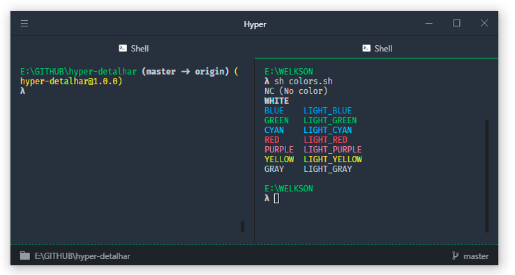

# hyper-detalhar
> A tiny dark theme for [hyper](https://hyper.is) terminal

[](https://www.npmjs.com/package/hyper-detalhar) [](https://travis-ci.org/detalhar/hyper-detalhar) [](https://standardjs.com/) [](https://raw.github.com/detalhar/hyper-detalhar/blob/master/LICENSE)



# Install

## Via Hyper terminal

1. `hyper i hyper-detalhar`

## Manually

1. Add ```hyper-detalhar``` to plugins in ```~/.hyper.js``` config file.
2. Restart Hyper.
3. Enjoy hyper-detalhar 🚀

## Tips

* [Fira Code](https://github.com/tonsky/FiraCode) - Font used for powerline

### On Linux

* [Oh My ZSH](https://github.com/robbyrussell/oh-my-zsh)
* [pure theme](https://github.com/sindresorhus/pure) or [spaceship-prompt theme](https://github.com/denysdovhan/spaceship-prompt)
* [zsh-syntax-highlighting](https://github.com/zsh-users/zsh-syntax-highlighting)

# Plugins
* [`hyperterm-tab-icons`](https://github.com/dfrankland/hyper-tab-icons) - Shows icon in the header tabs for the current running process.
* [`hyper-statusline`](https://github.com/henrikdahl/hyper-statusline) - Shows current directory and git status.

# License

MIT &copy; Detalhar Agência Digital
