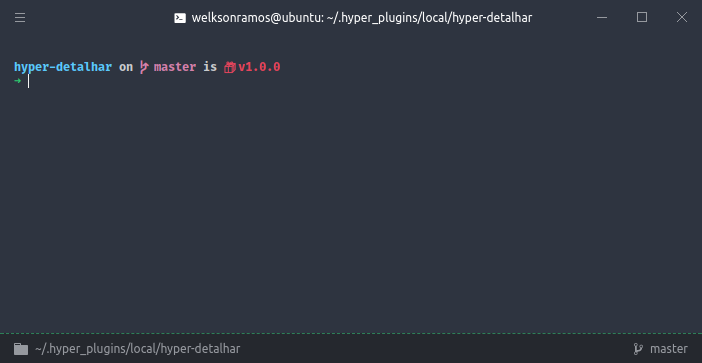

# hyper-detalhar
> A tiny dark theme for [hyper](https://hyper.is) terminal




# Install

## Manually

1. Add ```hyper-detalhar``` to plugins in ```~/.hyper.js``` config file.
2. Restart Hyper.

# Plugins
* [`hyperterm-tab-icons`](https://github.com/dfrankland/hyper-tab-icons) - Shows icon in the header tabs for the current running process.
* [`hyper-statusline`](https://github.com/henrikdahl/hyper-statusline) - Shows current directory and git status.
